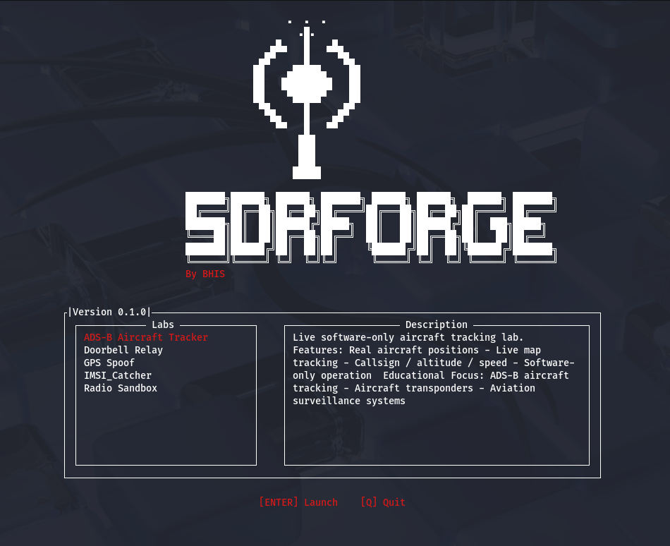

   
  &nbsp;
  
  &nbsp;
  
  &nbsp;
  
  &nbsp;
  
  

<h4><code>SDRForge</code> provides a safe and legal environment for learning radio hacking. Based on the open source tool WifiForge, this project automatically sets up the radio and wireless environments and tools needed to run a variety of exploitation labs, removing the need for the overhead and hardware normally required to perform these attacks.</h4>

  <h4>
    <a target="_blank" href="https://sdrforge.github.io/" rel="dofollow"><strong>Explore the Docs</strong></a>&nbsp;·&nbsp;
    <a target="_blank" href="https://discord.com/invite/bhis" rel="dofollow"><strong>Community Help</strong></a>&nbsp;·&nbsp;
    <a target="_blank" href="https://www.youtube.com/watch?v=lqvq3xH0qYM&t=8s" rel="dofollow"><strong>What is SDRForge?</strong></a>&nbsp;·&nbsp;
    <a target="_blank" href="https://www.blackhillsinfosec.com/sdrforge/" rel="dofollow"><strong>Blog Post</strong></a>
  </h4>

## Navigation

> Note: `SDRForge` is still in its infancy constantly changing and growing, with growth comes issues and pain. This product is not promised to be stable, and should not be used outside of a virtual machine at this time.

- [Installation Documentation](https://sdrforge.github.io/Installation)
- [Walkthroughs](https://sdrforge.github.io/Lab-Walkthroughs/)
- [Troubleshooting](https://sdrforge.github.io/Troubleshooting)
- [Overview](https://sdrforge.github.io/Overview)
- [Contributing](https://sdrforge.github.io/Development)

## References
- https://www.gnuradio.org/
- https://github.com/blackhillsinfosec/WifiForge

Made with ❤️ by Black Hills Infosec
